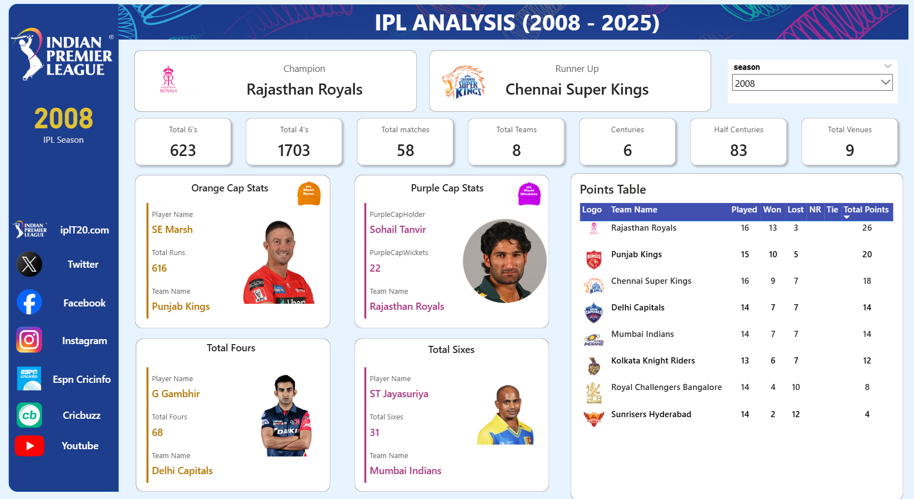
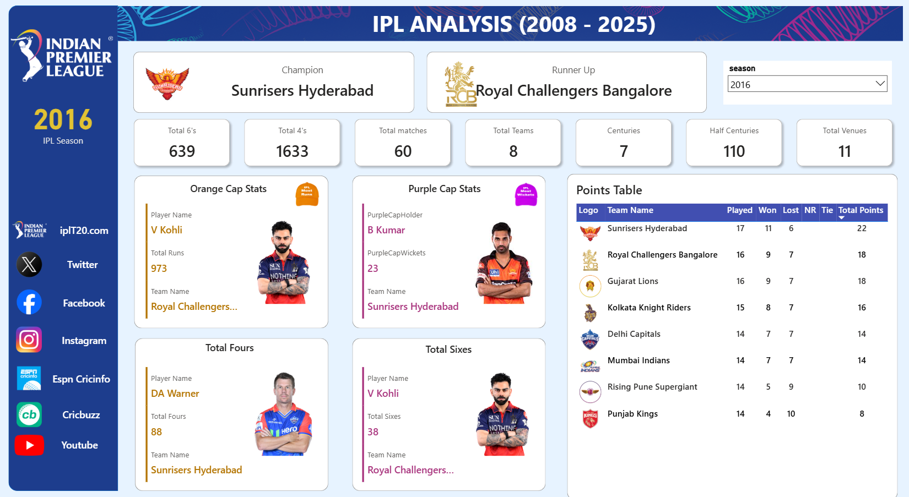
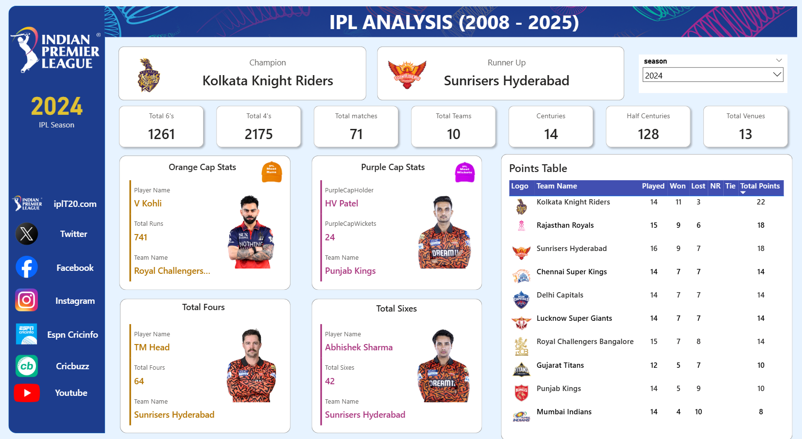
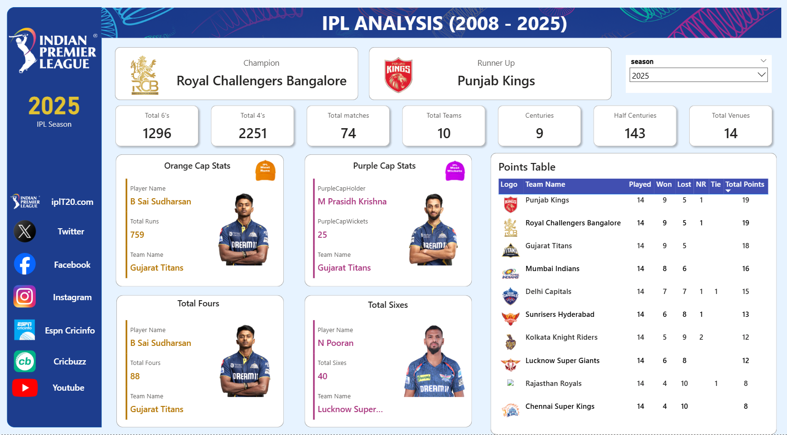

# 🏏📊 IPL Analysis Dashboard (2008–2025) | Power BI

Interactive Power BI dashboard providing comprehensive analysis of the **Indian Premier League (IPL)** spanning 18 seasons from 2008 to 2025, with special focus on season-end highlights including champion, runner-up, Orange Cap, Purple Cap, boundary leaders, and final points table.

### ⚠️ Problem Statement

Cricket fans, analysts, and fantasy league players face challenges in quickly accessing, comparing, and visualizing detailed IPL performance data across multiple seasons. Raw ball-by-ball datasets are voluminous and hard to interpret, while summary statistics from websites often lack interactivity, historical depth, and custom filtering — making it difficult to instantly see season winners, top performers, boundary trends, and league standings in one place.

### 🎯 Project Objective

To create a single, dynamic, and visually appealing Power BI dashboard that:
- Consolidates IPL data from 2008 to 2025
- Enables season-by-season exploration with one-click filtering
- Clearly displays the champion, runner-up, Orange Cap holder, Purple Cap holder, top four and six hitters
- Presents the complete points table for the selected season
- Shows key aggregate statistics across all seasons (total sixes, fours, matches, centuries, half-centuries, venues)
- Demonstrates clean data modeling, effective DAX calculations, and professional dashboard design using real sports data

### 🗃️ Dataset Overview

Star-schema model built from imported CSV files:

- **ball_by_ball_data** (Fact Table)  
  ~732,000 rows  
  Contains every delivery: batter, bowler, non-striker, team batting & bowling, over_number, ball_number, batter_runs, extras, total_runs, batsman_type (Right/Left hand), bowler_type, is_wicket, wicket_kind, wide/no-ball/bye/leg-bye flags, player_out, fielders_involved, etc.

- **ipl_matches_data** (Dimension Table)  
  Match-level metadata: match_id, match_date, city (venue), event_name, format, gender, match_type, etc.

- **teams_data** (Dimension Table)  
  Team details: team_id, team_name, team_name_short, city, image_url (for logos)

- **players-data-updated** (Dimension Table)  
  Player information: player_id, player_name, player_full_name, bat_style, bowl_style, player_image, etc.

**Relationships**  
Many-to-one connections from `ball_by_ball_data` to the three dimension tables on match_id, team names, and player names.

### 🔁 Workflow

1. **Initial Exploration & Cleaning**  
   Performed basic data review, duplicate removal, formatting, and validation in Microsoft Excel.

2. **Export to CSV**  
   Saved cleaned tables from Excel as CSV files for efficient import.

3. **Import into Power BI**  
   Loaded CSV files into Power BI Desktop using Get Data → Text/CSV.

4. **Power Query Transformations**  
   Applied data type corrections, removed unnecessary columns, handled nulls, and created helper columns where needed.

5. **Data Modeling**  
   Established star-schema relationships between fact and dimension tables.

6. **DAX Measures & Aggregations**  
   Created measures for totals (sixes, fours, matches, centuries, points, etc.), rankings, and dynamic calculations.

7. **Dashboard Design**  
   Built a single-page interactive dashboard with slicers, cards, tables, images, and conditional formatting.

## 📈 IPL Season-wise Insights

### Season 2008

### Season 2016

### Season 2024

### Season 2025

### 💡 Key Business Insights Delivered

(As displayed in the current dashboard – focused on 2025 season + historical aggregates)

- **Champion (2025)**: Royal Challengers Bengaluru (RCB)  
- **Runner Up (2025)**: Punjab Kings  
- **Orange Cap (Most Runs – 2025)**: B Sai Sudharsan – 759 runs (Gujarat Titans)  
- **Purple Cap (Most Wickets – 2025)**: M Prasidh Krishna – 25 wickets (Gujarat Titans)  
- **Most Fours (2025)**: B Sai Sudharsan – 88 fours (Gujarat Titans)  
- **Most Sixes (2025)**: N Pooran – 40 sixes (Lucknow Super Giants)  
- **Points Table Highlights (2025)**:  
  - Punjab Kings & Royal Challengers Bengaluru – 19 points each (9 wins, 14 matches)  
  - Gujarat Titans – 18 points  
  - Mumbai Indians – 16 points  
  - Delhi Capitals – 15 points  
- **Overall Aggregates (2025)**:  
  - Total 6's: 1,296  
  - Total 4's: 2,251  
  - Total Matches: 74  
  - Total Teams: 10  
  - Centuries: 9  
  - Half Centuries: 143  
  - Total Venues: 14  

### 🧰 Tech Stack

- Microsoft Excel – Initial data exploration, cleaning & basic validation  
- CSV – File format for data transfer  
- Power BI Desktop – Data import, Power Query transformations, star-schema modeling, DAX calculations, interactive visualizations & dashboard layout  
- DAX – Measures for aggregates, rankings, and dynamic KPI cards  

This project demonstrates a complete data analytics workflow — from raw Excel handling to professional interactive BI reporting — using publicly available cricket data.
